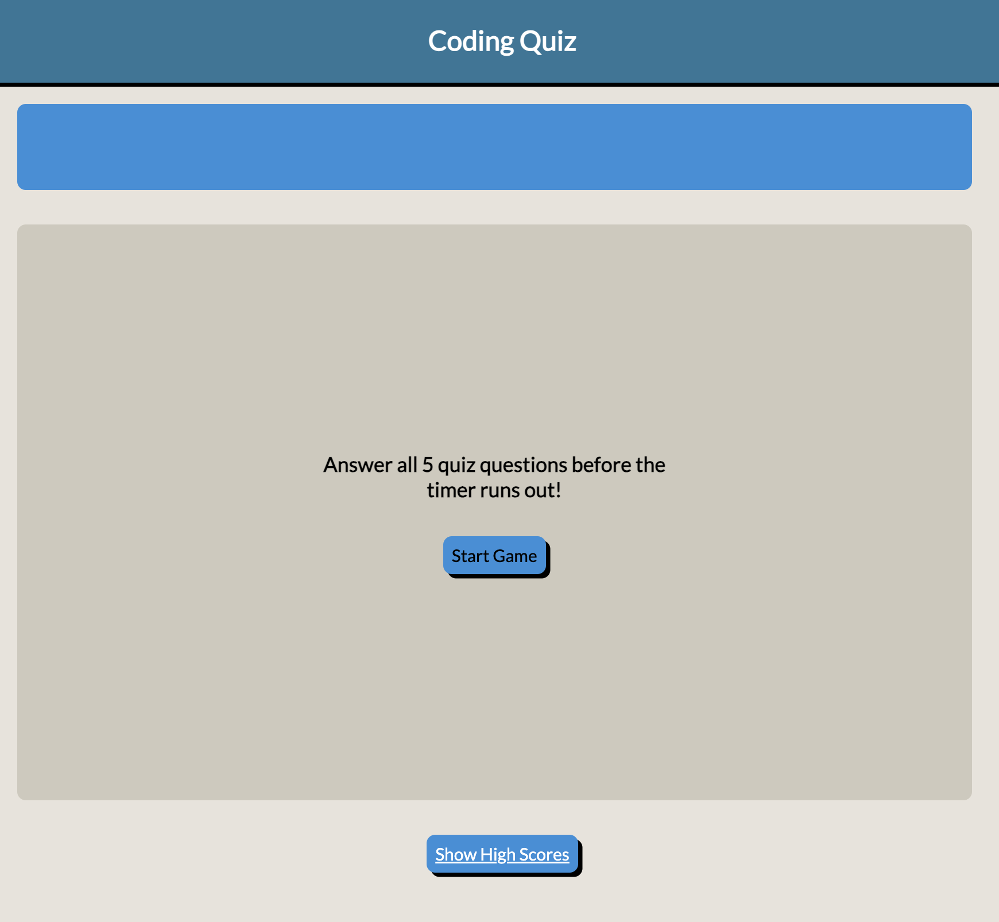
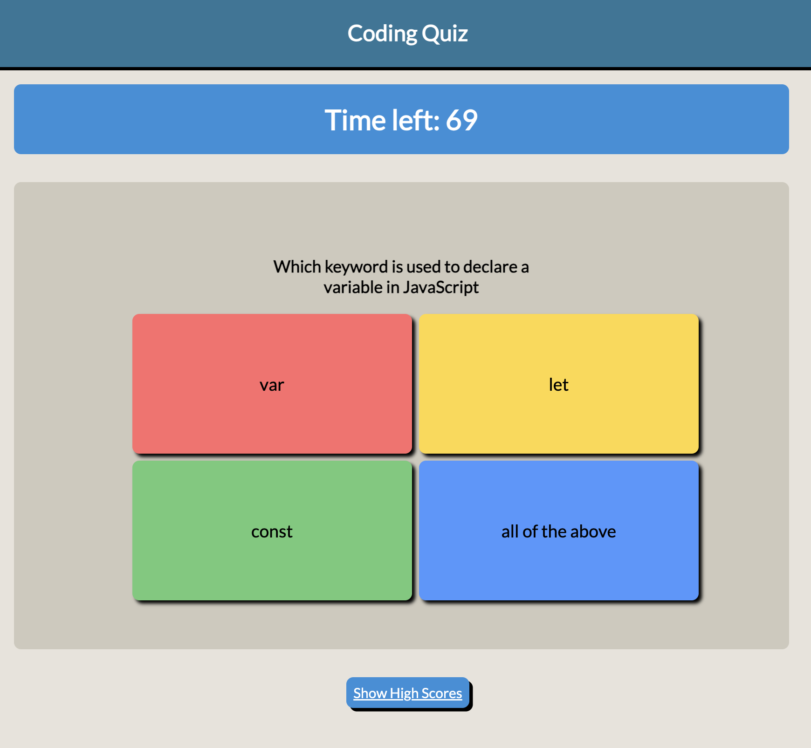
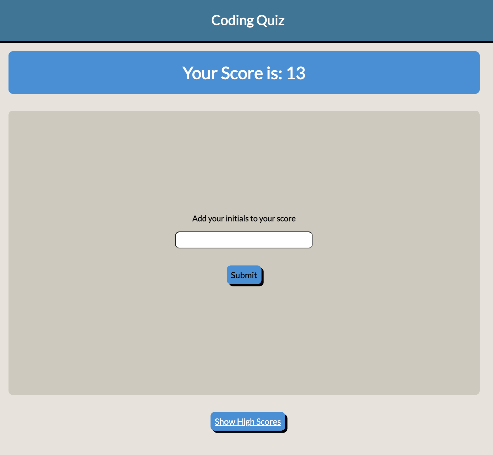
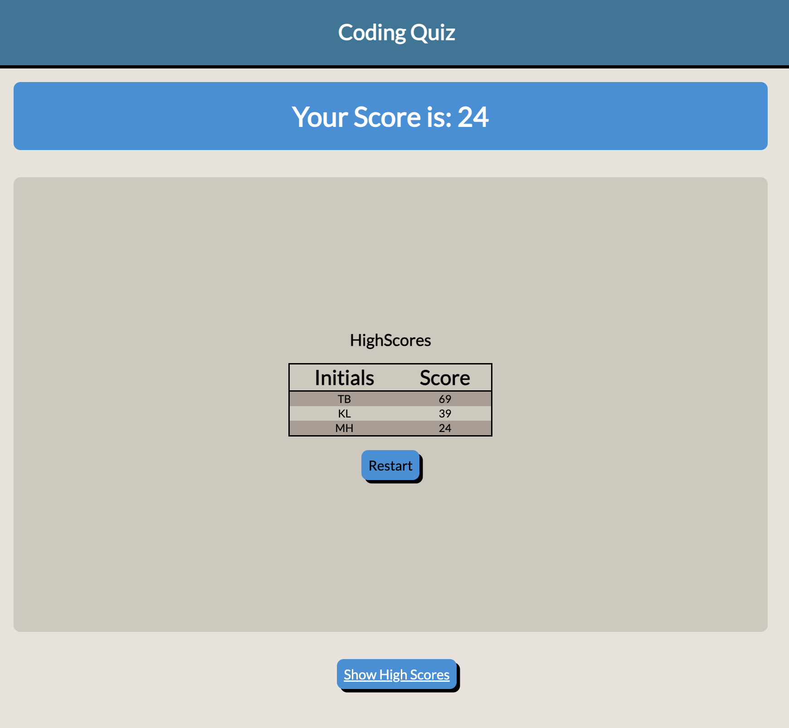

# Code-Quiz

## Description
The following project titled Code-Quiz has been created as a part of the Adelaide University Coding Bootcamp. I took some inspiration from Kahoot in terms of it's multiple choice question layout and created a quiz of 5 questions surrounding javascript coding. The final score will be saved into a high score table. 

During the project I learn how to use key functionalities within javascript including but not limited to:
- DOM Manipulation
- Creating a timer with the setInterval function
- Data Input
- Click events

Live link: https://klanger98.github.io/Code-Quiz/

## Usage
In order to launch the website click the link above.

You will be presented with an introduction screen, click the 'Start Game' button to proceed to the quiz

Continue answering all quiz questions as fast as you can before the 75 seconds runs out. For every incorrect answer, your timer will decrease by 15. For every wrong or right answer the screen will react with colors with red representing wrong and green showing you've answered correctly. 

Once the 5 questions are completed you score will equal the amount of time left and you will be asked to input your initials.

After inputting your initials a high score table will be generated. You can then choose to restart the quiz. 

